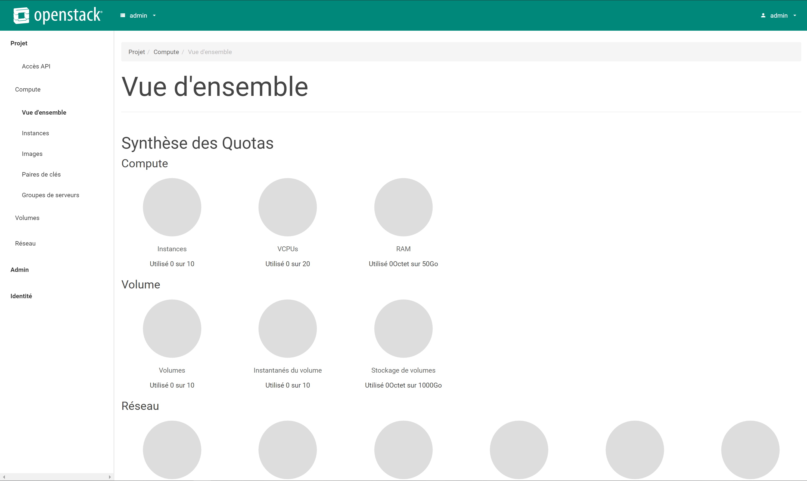

# Déploiement "All In One" d'OpenStack avec Ansible

Le déploiement "All In One" permet d'effectuer une installation d'OpenStack sur une seule machine physique ou virtuelle. Ceci est réalisable en créant des conteneur LXC qui hébergeront les defférents services d'OpenStack.

_Toute cette documentation a été réalisée avec l'utilisateur `root` ce qui est vivement déconseillé pour des raisons de sécurité_\
_Comme l'exécution de certaines commandes peuvent être longues je recommende d'utiliser un outils comme `tmux` ou `screen` afni de parer aux problèmes liés au possibles déconnexion accidentelles_

## I) Topologie

Pour ce projet je n'utiliserai qu'une seule VM CentOS 7 avec un total de 8 coeurs, 20Go de RAM, un disque de 100Go et un autre de 1To avec l'accélération processeur pour la virtualisation par virtualisation imbriquée.

## II) Préparation de l'hôte

* Il faut commencer par mettre à jour le système :

```bash
[root@aio ~]# yum update -y
```

* Ensuite installer `git` :

```bash
[root@aio ~]# yum install git
```

* Désactivation de `selinux` :
Pour l'instant `openstack-ansible` ne supporte pas que `selinux` soit activé.

```bash
[root@aio ~]# sed -i 's/enforcing/permissive/g' /etc/selinux/config
```

* Désactivation du pare-feu :
Pour éviter que le pare-feu bloque la communication entre l'hôte et les conteneurs je recommande de le désactiver temporairement.

```bash
[root@aio ~]# systemctl stop firewalld
[root@aio ~]# systemctl disable firewalld
Removed symlink /etc/systemd/system/multi-user.target.wants/firewalld.service.
Removed symlink /etc/systemd/system/dbus-org.fedoraproject.FirewallD1.service.
```

* Redémarrage de l'hôte :
Afin de valider les changement il faut redémarrer la machine

```bash
[root@aio ~]# reboot
```

## III) Dépôt Git

Il faut récupérer les fichier sur le dépôt git.

```bash
[root@aio ~]# git clone https://opendev.org/openstack/openstack-ansible /opt/openstack-ansible
Cloning into '/opt/openstack-ansible'...
remote: Enumerating objects: 71016, done.
remote: Counting objects: 100% (71016/71016), done.
remote: Compressing objects: 100% (28210/28210), done.
remote: Total 71016 (delta 47809), reused 62319 (delta 39806)
Receiving objects: 100% (71016/71016), 17.62 MiB | 5.85 MiB/s, done.
Resolving deltas: 100% (47809/47809), done.
[root@aio ~]# cd /opt/openstack-ansible
[root@aio openstack-ansible]#
```

Ensuite on doit lister les version d'OpenStack qu'on peut utiliser.

```bash
[root@aio openstack-ansible]# git branch -a
* master
  remotes/origin/HEAD -> origin/master
  remotes/origin/master
  remotes/origin/stable/ocata
  remotes/origin/stable/pike
  remotes/origin/stable/queens
  remotes/origin/stable/rocky
  remotes/origin/stable/stein
```

Après on peut choisir la bonne version.

```bash
[root@aio openstack-ansible]# git checkout stable/stein
Branch stable/stein set up to track remote branch stable/stein from origin.
Switched to a new branch 'stable/stein'
```

## IV) Bootstrap Ansible

Il faut exécuter le script `scripts/bootstrap-ansible.sh`.

```bash
[root@aio openstack-ansible]# ./scripts/bootstrap-ansible.sh
```

Le script va créer plusieurs liens symboliques, après l'exécution il est possible de vérifier que le script ce soit exécuter correctement.

```bash
[root@aio openstack-ansible]# ls -ld /opt/*
drwxr-xr-x.  5 root root   56 Aug  7 17:37 /opt/ansible-runtime
drwxr-xr-x. 15 root root 4096 Aug  7 17:38 /opt/openstack-ansible
[root@aio openstack-ansible]# ls -ltr /usr/local/bin/
total 8
lrwxrwxrwx. 1 root root   32 Aug  7 17:38 ansible -> /usr/local/bin/openstack-ansible
lrwxrwxrwx. 1 root root   39 Aug  7 17:38 ansible-config -> /opt/ansible-runtime/bin/ansible-config
lrwxrwxrwx. 1 root root   43 Aug  7 17:38 ansible-connection -> /opt/ansible-runtime/bin/ansible-connection
lrwxrwxrwx. 1 root root   36 Aug  7 17:38 ansible-doc -> /opt/ansible-runtime/bin/ansible-doc
lrwxrwxrwx. 1 root root   40 Aug  7 17:38 ansible-console -> /opt/ansible-runtime/bin/ansible-console
lrwxrwxrwx. 1 root root   39 Aug  7 17:38 ansible-galaxy -> /opt/ansible-runtime/bin/ansible-galaxy
lrwxrwxrwx. 1 root root   42 Aug  7 17:38 ansible-inventory -> /opt/ansible-runtime/bin/ansible-inventory
lrwxrwxrwx. 1 root root   32 Aug  7 17:38 ansible-playbook -> /usr/local/bin/openstack-ansible
lrwxrwxrwx. 1 root root   38 Aug  7 17:38 ansible-vault -> /opt/ansible-runtime/bin/ansible-vault
lrwxrwxrwx. 1 root root   37 Aug  7 17:38 ansible-pull -> /opt/ansible-runtime/bin/ansible-pull
-rw-r--r--. 1 root root 3312 Aug  7 17:38 openstack-ansible.rc
-rwxr-xr-x. 1 root root 2758 Aug  7 17:38 openstack-ansible
```

Il est aussi possible de vérifier que `Ansible` soit bien installé.

```bash
[root@aio openstack-ansible]# which ansible
/usr/local/bin/ansible
```

## V) Bootstrap AIO

Maintenant il faut déployer les conteneurs pour les différents services d'OpenStack.\
_Pour modifier les options de déploiement par défaut reportez-vous à la [documentation officielle](https://docs.openstack.org/openstack-ansible/latest/user/aio/quickstart.html#bootstrap-the-aio-configuration) afin d'optenir plus de détails._

Pour cette documentation la machine a un deuxième disque (`sdb`), pour l'utiliser il faut le préciser avant l'exécution du script.

```bash
[root@aio openstack-ansible]# export BOOTSTRAP_OPTS="bootstrap_host_data_disk_device=sdb"
```

Ensuite pour exécuter le script :

```bash
[root@aio openstack-ansible]# ./scripts/bootstrap-aio.sh
```

## VI) Exécution des Playbooks Ansible

_Cette opération peut être assez longue, d'après la documentation officielle le temps peut varier entre 30 minutes et 2 heures en fonction de la configuration du système._

Il faut commencer par se rendre dans le dossier contenant les playbooks et ensuite les exécuter.

```bash
[root@aio ~]# cd /opt/openstack-ansible/playbooks
[root@aio playbooks]# pwd
/opt/openstack-ansible/playbooks
```

```bash
[root@aio playbooks]# openstack-ansible setup-hosts.yml
[root@aio playbooks]# openstack-ansible setup-infrastructure.yml
[root@aio playbooks]# openstack-ansible setup-openstack.yml
```

Il est aussi possible d'exécuter les 3 playbooks en un seul.

```bash
[root@aio playbooks]# openstack-ansible setup-everything.yml
```

Après l'exécutiondes playbooks il est possible de vérifier si les conteneurs sont bien en cours d'exécution.

```bash
[root@aio playbooks]# lxc-ls --fancy
NAME                                   STATE   AUTOSTART GROUPS            IPV4
aio1_cinder_api_container-753dbbb0     RUNNING 1         onboot, openstack 10.255.255.140, 172.29.237.57, 172.29.246.97
aio1_galera_container-176bfbc3         RUNNING 1         onboot, openstack 10.255.255.4, 172.29.237.72
aio1_glance_container-f86914b1         RUNNING 1         onboot, openstack 10.255.255.119, 172.29.237.10, 172.29.246.217
aio1_horizon_container-7d3d8985        RUNNING 1         onboot, openstack 10.255.255.103, 172.29.239.117
aio1_keystone_container-33c2fe04       RUNNING 1         onboot, openstack 10.255.255.79, 172.29.236.86
aio1_memcached_container-c2b87094      RUNNING 1         onboot, openstack 10.255.255.73, 172.29.237.126
aio1_neutron_server_container-fa3650ad RUNNING 1         onboot, openstack 10.255.255.185, 172.29.238.98
aio1_nova_api_container-f64a9317       RUNNING 1         onboot, openstack 10.255.255.105, 172.29.239.37
aio1_rabbit_mq_container-b90a94c8      RUNNING 1         onboot, openstack 10.255.255.72, 172.29.238.46
aio1_repo_container-7cefa756           RUNNING 1         onboot, openstack 10.255.255.165, 172.29.237.200
aio1_utility_container-2973acda        RUNNING 1         onboot, openstack 10.255.255.132, 172.29.238.99
```

## VII) Accès au Dashboard

Pour accéder au dashboard il faut récupérer la bonne adresse IP et le mot de passe.

```bash
[root@aio playbooks]# netstat -pan | grep -i 443
tcp        0      0 172.29.236.100:443      0.0.0.0:*               LISTEN      1458/haproxy
tcp        0      0 192.168.20.135:443      0.0.0.0:*               LISTEN      1458/haproxy
```

```bash
[root@aio playbooks]# grep keystone_auth_admin_password /etc/openstack_deploy/user_secrets.yml
keystone_auth_admin_password: 175327e9a3a26831d644614922bbbe9aabbc7f2c435965e237

```



## VIII) Redémarrage d'un AIO

En cas de redémarrage de l'hôte le cluster galera doit être réinitialiser pour le bon fonctionnement des services.

```bash
[root@aio1 ~]# cd /opt/openstack-ansible/playbooks
[root@aio1 ~]# openstack-ansible -e galera_ignore_cluster_state=true galera-install.yml
```

## IX) Reconstruction d'un AIO

Pour reconstruire totalement l'installation il faut suivre plusieurs étapes afin de désinstaller proprement l'installation existante.

```bash
# # Aller dans le répertoire des playbooks.
# cd /opt/openstack-ansible/playbooks

# # Détruire les conteneurs existants.
# openstack-ansible lxc-containers-destroy.yml

# # Stoper les services qui sont exécutés localement.
# for i in \
       $(ls /etc/init \
         | grep -e "nova\|swift\|neutron\|cinder" \
         | awk -F'.' '{print $1}'); do \
    service $i stop; \
  done

# # Désinstaller les services.
# for i in $(pip freeze | grep -e "nova\|neutron\|keystone\|swift\|cinder"); do \
    pip uninstall -y $i; done

# # Supprimer les logs existants
# rm -rf /openstack /etc/{neutron,nova,swift,cinder} \
         /var/log/{neutron,nova,swift,cinder}

# # Supprimer la configuration de pip.
# rm -rf /root/.pip

# # Supprimer le proxy du manageur de paquets.
# rm /etc/apt/apt.conf.d/00apt-cacher-proxy
```
